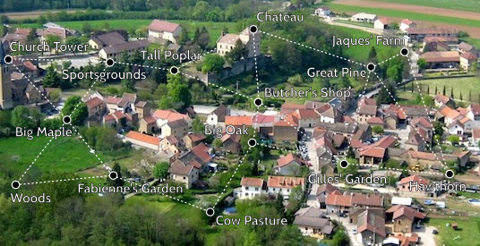

# 十一、异步编程

> 孰能浊以澄？静之徐清；
> 
> 孰能安以久？动之徐生。
> 
> 老子，《道德经》

计算机的核心部分称为处理器，它执行构成我们程序的各个步骤。 到目前为止，我们看到的程序都是让处理器忙碌，直到他们完成工作。 处理数字的循环之类的东西，几乎完全取决于处理器的速度。

但是许多程序与处理器之外的东西交互。 例如，他们可能通过计算机网络进行通信或从硬盘请求数据 - 这比从内存获取数据要慢很多。

当发生这种事情时，让处理器处于闲置状态是可耻的 - 在此期间可以做一些其他工作。 某种程度上，它由您的操作系统处理，它将在多个正在运行的程序之间切换处理器。 但是，我们希望单个程序在等待网络请求时能做一些事情，这并没有什么帮助。

## 异步

在同步编程模型中，一次只发生一件事。 当您调用执行长时间操作的函数时，它只会在操作完成时返回，并且可以返回结果。 这会在您执行操作的时候停止您的程序。

异步模型允许同时发生多个事件。 当你开始一个动作时，你的程序会继续运行。 当动作结束时，程序会受到通知并访问结果（例如从磁盘读取的数据）。

我们可以使用一个小例子来比较同步和异步编程：一个从网络获取两个资源然后合并结果的程序。

在同步环境中，只有在请求函数完成工作后，它才返回，执行此任务的最简单方法是逐个创建请求。 这有一个缺点，仅当第一个请求完成时，第二个请求才会启动。 所花费的总时间至少是两个响应时间的总和。

在同步系统中解决这个问题的方法是启动额外的控制线程。 线程是另一个正在运行的程序，它的执行可能会交叉在操作系统与其他程序当中 - 因为大多数现代计算机都包含多个处理器，所以多个线程甚至可能同时运行在不同的处理器上。 第二个线程可以启动第二个请求，然后两个线程等待它们的结果返回，之后它们重新同步来组合它们的结果。

在下图中，粗线表示程序正常花费运行的时间，细线表示等待网络所花费的时间。 在同步模型中，网络所花费的时间是给定控制线程的时间线的一部分。 在异步模型中，从概念上讲，启动网络操作会导致时间轴中出现分裂。 启动该动作的程序将继续运行，并且该动作将与其同时发生，并在程序结束时通知该程序。


另一种描述差异的方式是，等待动作完成在同步模型中是隐式的，而在异步模型中，在我们的控制之下，它是显式的。

异步性是个双刃剑。 它可以生成不适合直线控制模型的程序，但它也可以使直线控制的程序更加笨拙。 本章后面我们会看到一些方法来解决这种笨拙。

两种重要的 JavaScript 编程平台（浏览器和 Node.js）都可能需要一段时间的异步操作，而不是依赖线程。 由于使用线程进行编程非常困难（理解程序在同时执行多个事情时所做的事情要困难得多），这通常被认为是一件好事。

## 乌鸦科技

大多数人都知道乌鸦非常聪明。 他们可以使用工具，提前计划，记住事情，甚至可以互相沟通这些事情。

大多数人不知道的是，他们能够做一些事情，并且对我们隐藏得很好。我听说一个有声望的（但也有点古怪的）专家 corvids 认为，乌鸦技术并不落后于人类的技术，并且正在迎头赶上。

例如，许多乌鸦文明能够构建计算设备。 这些并不是电子的，就像人类的计算设备一样，但是它们操作微小昆虫的行动，这种昆虫是与白蚁密切相关的物种，它与乌鸦形成了共生关系。 鸟类为它们提供食物，对之对应，昆虫建立并操作复杂的殖民地，在其内部的生物的帮助下进行计算。

这些殖民地通常位于大而久远的鸟巢中。 鸟类和昆虫一起工作，建立一个球形粘土结构的网络，隐藏在巢的树枝之间，昆虫在其中生活和工作。

为了与其他设备通信，这些机器使用光信号。 鸟类在特殊的通讯茎中嵌入反光材料片段，昆虫校准这些反光材料将光线反射到另一个鸟巢，将数据编码为一系列快速闪光。 这意味着只有具有完整视觉连接的巢才能沟通。

我们的朋友 corvid 专家已经绘制了 Rhône 河畔的 Hières-sur-Amby 村的乌鸦鸟巢网络。 这张地图显示了鸟巢及其连接。

在一个令人震惊的趋同进化的例子中，乌鸦计算机运行 JavaScript。 在本章中，我们将为他们编写一些基本的网络函数。



## 回调

异步编程的一种方法是使执行慢动作的函数接受额外的参数，即回调函数。动作开始，当它结束时，使用结果调用回调函数。

例如，在 Node.js 和浏览器中都可用的`setTimeout`函数，等待给定的毫秒数（一秒为一千毫秒），然后调用一个函数。

```js
setTimeout(() => console.log("Tick"), 500);
```

等待通常不是一种非常重要的工作，但在做一些事情时，例如更新动画或检查某件事是否花费比给定时间更长的时间，可能很有用。

使用回调在一行中执行多个异步操作，意味着您必须不断传递新函数来处理操作之后的计算延续。

大多数乌鸦鸟巢计算机都有一个长期的数据存储设备，其中的信息刻在小树枝上，以便以后可以检索。雕刻或查找一段数据需要一些时间，所以长期存储的接口是异步的，并使用回调函数。

存储设备按照名称存储 JSON 编码的数据片段。乌鸦可以存储它隐藏食物的地方的信息，其名称为`"food caches"`，它可以包含指向其他数据片段的名称数组，描述实际的缓存。为了在 Big Oak 鸟巢的存储设备中查找食物缓存，乌鸦可以运行这样的代码：

```js
import {bigOak} from "./crow-tech";

bigOak.readStorage("food caches", caches => {
  let firstCache = caches[0];
  bigOak.readStorage(firstCache, info => {
    console.log(info);
  });
});
```

（所有绑定名称和字符串都已从乌鸦语翻译成英语。）

这种编程风格是可行的，但缩进级别随着每个异步操作而增加，因为您最终会在另一个函数中。 做更复杂的事情，比如同时运行多个动作，会变得有点笨拙。

乌鸦鸟巢计算机为使用请求-响应对进行通信而构建。 这意味着一个鸟巢向另一个鸟巢发送消息，然后它立即返回一个消息，确认收到，并可能包括对消息中提出的问题的回复。

每条消息都标有一个类型，它决定了它的处理方式。 我们的代码可以为特定的请求类型定义处理器，并且当这样的请求到达时，调用处理器来产生响应。

`"./crow-tech"`模块所导出的接口为通信提供基于回调的函数。 鸟巢拥有`send`方法来发送请求。 它接受目标鸟巢的名称，请求的类型和请求的内容作为它的前三个参数，以及一个用于调用的函数，作为其第四个和最后一个参数，当响应到达时调用。

```js
bigOak.send("Cow Pasture", "note", "Let's caw loudly at 7PM",
            () => console.log("Note delivered."));
```

但为了使鸟巢能够接收该请求，我们首先必须定义名为`"note"`的请求类型。 处理请求的代码不仅要在这台鸟巢计算机上运行，而且还要运行在所有可以接收此类消息的鸟巢上。 我们只假定一只乌鸦飞过去，并将我们的处理器代码安装在所有的鸟巢中。

```js
import {defineRequestType} from "./crow-tech";

defineRequestType("note", (nest, content, source, done) => {
  console.log(`${nest.name} received note: ${content}`);
  done();
});
```

`defineRequestType`函数定义了一种新的请求类型。该示例添加了对`"note"`请求的支持，它只是向给定的鸟巢发送备注。我们的实现调用`console.log`，以便我们可以验证请求到达。鸟巢有`name`属性，保存他们的名字。

给`handler`的第四个参数done，是一个回调函数，它在完成请求时必须调用。如果我们使用了处理器的返回值作为响应值，那么这意味着请求处理器本身不能执行异步操作。执行异步工作的函数通常会在完成工作之前返回，安排回调函数在完成时调用。所以我们需要一些异步机制 - 在这种情况下是另一个回调函数 - 在响应可用时发出信号。

某种程度上，异步性是传染的。任何调用异步的函数的函数，本身都必须是异步的，使用回调或类似的机制来传递其结果。调用回调函数比简单地返回一个值更容易出错，所以以这种方式构建程序的较大部分并不是很好。

